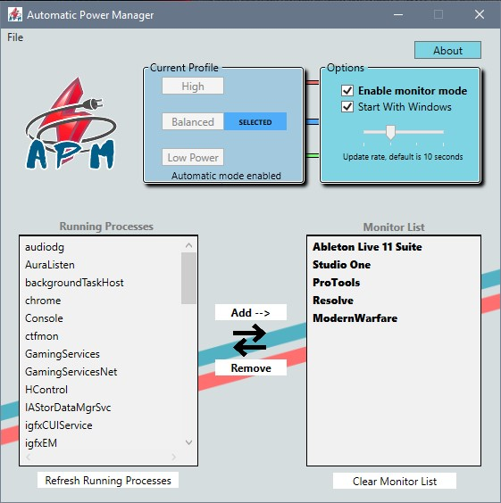

The Automatic Power Manager for Windows 10 provides the ability to switch to High Performance mode automatically based on the running apps. If none of these apps are running, it defaults to Balanced Mode.

How to Use:

1. Launch APM and add a program from the running processes list to the monitor list. If your application isn't on the running list, ensure your program is running and click the "Refresh Running Processes" button. From now on, when you run this program, your laptop will automatically switch to High Performance Mode.
(Note: If your app is already on the monitor list, it will not appear in the running processes list.)

Options:

This section offers three options:

1. Monitor Mode: Enable or disable the automatic switching of power profiles.
2. Start up with Windows: Enable or disable automatic startup with Windows.
3. Rate Slider: Choose the speed of the auto-switching process, ranging from 5 to 20 seconds. The default is set to 10 seconds.

Current Features:

1. When running on battery power and no monitored apps are active, the app will switch to Low Power mode instead of Balanced.
2. Receive notifications when switching between power profiles.
3. The app requires three power profiles (Low, Balanced, and High) to function correctly. If any of these profiles are missing, the app will create them.

Example Use Case:

Applications like Ableton and others that require real-time effects may experience stuttering when performing even simple projects, despite being used on a powerful laptop. The reason is straightforward: the balanced power profile on your laptop adjusts the CPU core clock to maintain cooling and efficiency. However, during tasks like music production, this fluctuation in CPU clock should be avoided to prevent glitches and disruptions. While you can manually set your laptop to High Performance mode for such tasks, there's a risk of forgetting to do so and potentially ruining a good take. Additionally, it's easy to forget to switch back to an efficient power profile like 'Balanced' once you're finished. This app resolves these issues automatically.

Requirements: Windows 10 laptop.

Download link below.

https://github.com/KTAppDev/Switch-Power-profile/releases/tag/1.09

To uninstall just use regular windows program uninstaller / add remove programs.

PS. The UI looks like crap, I know.

Interested in collaborating on this project please send mail to kentaylorappdev@gmail.com

